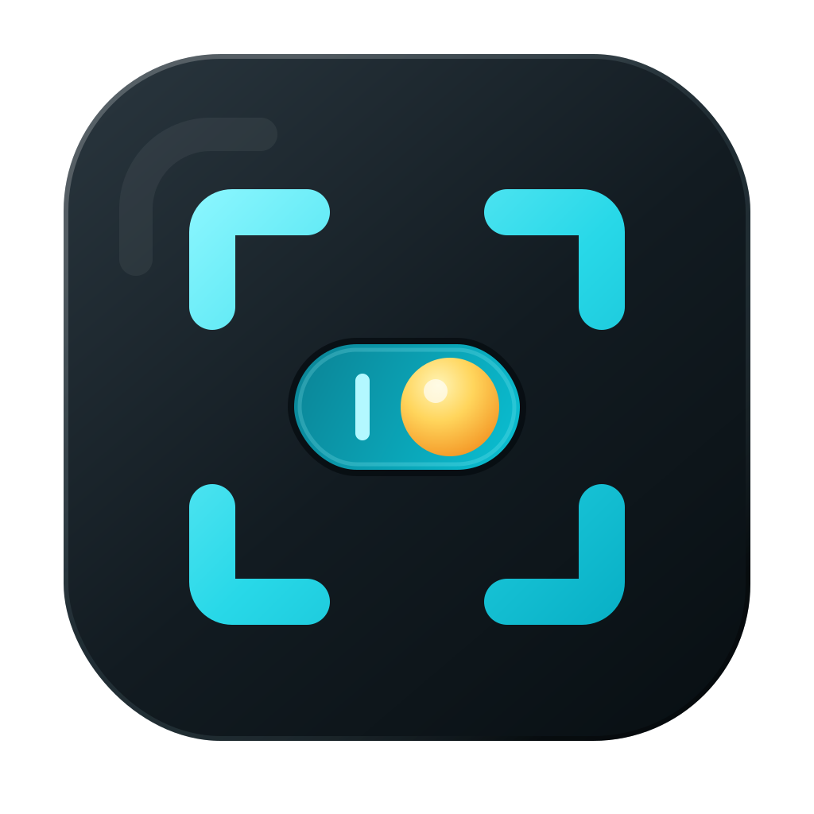

<p align="center">
  
</p>

<h1 align="center">Hot Corner Toggle</h1>

<p align="center">A macOS menu bar app for turning Hot Corners on or off, saving corner layouts as presets, and automatically applying them for specific apps.</p>

---

## Features

- **One-click toggle** — enable or disable all four macOS Hot Corners from the menu bar
- **Presets** — save named configurations for all four corners and apply them whenever you need them
- **Full corner control** — configure each corner with actions including Mission Control, Desktop, Lock Screen, Quick Note, Notification Center, Launchpad, and more
- **Modifier keys** — require Shift, Control, Option, Command, or a combination before a corner action runs
- **App rules** — automatically apply a preset when a chosen app is focused or running
- **Automatic restore** — restores the previous Hot Corner configuration after an app rule no longer applies
- **Launch on Login** — optionally start Hot Corner Toggle when you sign in

## Install

### Download the prebuilt binary

1. Go to [Releases](../../releases) and download `Hot-Corner-Toggle-macOS.zip`
2. Unzip and move `Hot Corner Toggle.app` to `/Applications`
3. **Bypass Gatekeeper** (the app is ad-hoc signed, not notarized):
   - Right-click the app → **Open** → **Open** in the dialog
   - Or run: `xattr -cr "/Applications/Hot Corner Toggle.app"`
4. Launch the app — its icon appears in the menu bar

### Build from source

```bash
git clone https://github.com/b4iterdev/HotCornerToggle.git
cd HotCornerToggle
open "Hot Corner Toggle.xcodeproj"
```

Build and run in Xcode (Cmd+R). Requires Xcode 16+ and macOS 26.5+.

## Usage

### Enable or disable Hot Corners

Click the app icon in the menu bar, then use the **Hot Corners** switch. Disabling Hot Corners turns off all four corners while preserving your current configuration, so turning them back on restores it.

> Changes take effect immediately. macOS briefly restarts the Dock when the app updates Hot Corner settings.

### Create and use a preset

1. Click **+** in the **Presets** section
2. Name the preset and choose an action for each corner
3. Optionally assign modifier keys that must be held to trigger each action
4. Save it, then choose **Apply now** from the preset menu

Use **Capture Current** in the preset editor to begin with your existing macOS Hot Corner configuration.

### Apply a preset automatically for an app

1. Create at least one preset
2. Click **+** in the **App Rules** section
3. Choose a running app or browse for an app in Finder
4. Select a preset and when to apply it:
   - **When Focused** — applies while the app is frontmost
   - **When Running** — applies while the app remains open
5. Save the rule

When the rule stops applying, Hot Corner Toggle restores the configuration that was active beforehand. A focused-app rule takes priority over a running-app rule.

## How it works

macOS does not provide a public Cocoa API for managing Hot Corners. Hot Corner Toggle reads and writes the standard `com.apple.dock` preference values used by macOS, then restarts the Dock so the new configuration is applied immediately. It does not use private APIs or require Accessibility permissions.

## License

MIT License
